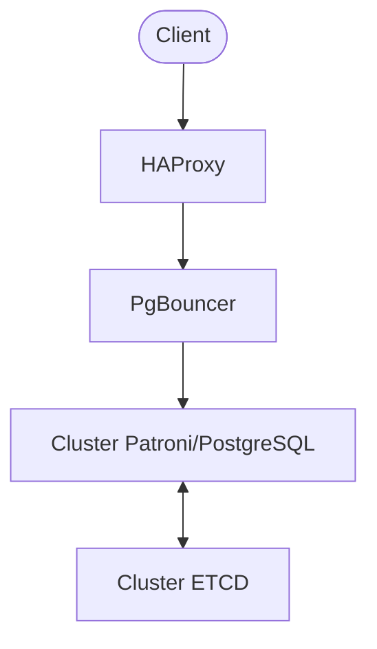

# Cluster PostgreSQL Haute Disponibilité (HA) Hardened - RHEL 8

Ce projet implémente un cluster PostgreSQL 17 hautement sécurisé et résilient, orchestré par **Patroni** et **ETCD**, basé sur des images **RHEL 8 (UBI)**.

## 🏗️ Architecture System

Le cluster repose sur une architecture multi-composants assurant la haute disponibilité et le pooling de connexions.

👉 **Details complets : [Architecture & Flux](documentation/architecture.md)**

---

## 📚 Espace Documentation

Retrouvez ici l'ensemble des guides pour l'installation, l'exploitation et la maintenance du cluster.

### 🚀 Démarrage
- [**Quick Start Guide**](documentation/QUICKSTART.md) : Déployer le cluster en 3 minutes.
- [**Images Docker**](documentation/docker_images.md) : Hiérarchie, build et rôles des conteneurs.
- [**Sources des Paquets**](documentation/package_sources.md) : Origine des RPMs et paquets PIP (UBI, PGDG, EPEL).

### 🛠️ Administration & Exploitation
- [**Index des Procédures**](documentation/procedures/README.md) : Sauvegarde, restauration, maintenance etcd.
- [**Guide des Scripts**](documentation/scripts/README.md) : Description des outils d'automatisation situés dans `scripts/`.
- [**Matrice des Tests**](documentation/tests.md) : Détails des validations de sécurité et performance.

### 🔐 Sécurité & Hardening
- **End-to-End TLS** : Chiffrement intégral de tous les flux.
- **mTLS Flexible** : Exigence de certificats clients configurable.
- **Isolation** : Crédentials distincts et accès restreints.

---

## 📊 Rapports et Audit
Chaque exécution de la suite de tests complète génère un rapport détaillé :
- **Rapports d'Audit** : Disponibles dans le répertoire `./reports/`.
- **Lancer un audit** : `make big-test`

---
[Accéder au QUICKSTART](documentation/QUICKSTART.md)
