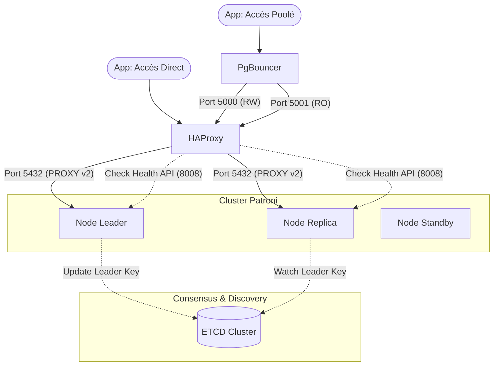

# 🏗️ Architecture du Cluster

Ce document présente l'architecture globale du cluster PostgreSQL Haute Disponibilité et les flux de données entre ses composants.

## 🗺️ Vision Globale (8 Nœuds)

Le cluster est conçu pour la résilience avec une séparation stricte des rôles.

## 🔄 Flux de Données

1. **Pooling de Connexions (PgBouncer)** :
   - L'application se connecte d'abord à **PgBouncer** (Port 6432).
   - PgBouncer gère le pool de sessions pour optimiser les ressources.
   - Il est configuré avec **Full TLS** (Client & Server side).
   - Il redirige ensuite les requêtes vers HAProxy selon le type de base demandée (`postgres_rw` ou `postgres_ro`).

2. **Routage Intelligent (HAProxy)** :
   - HAProxy reçoit le trafic depuis PgBouncer sur les ports **5000 (RW)** ou **5001 (RO)**.
   - **Check de Santé** : Il interroge en permanence l'API REST de Patroni (**Port 8008**) en HTTPS pour identifier dynamiquement le rôle de chaque nœud (`/primary` ou `/replica`).
   - **Protocole PROXY v2** : Il transmet l'adresse IP réelle du client à PostgreSQL.
   - **Terminaison SSL** : HAProxy gère le chiffrement TLS pour les backends.

3. **Consensus (ETCD)** :
   - Patroni utilise ETCD pour stocker l'état du cluster et effectuer l'élection du Leader.
   - En cas de perte d'ETCD (perte du quorum), Patroni passe les bases PostgreSQL en lecture seule par sécurité.

## 📂 Organisation Multi-Datacenter

- **DC1 (Principal)** : `node1`, `node2`, `etcd1`, `etcd2`.
- **DC2 (Remote/Quorum)** : `node3`, `etcd3`, `haproxy`, `pgbouncer`.

---
[Retour à l'accueil](../README.md)
