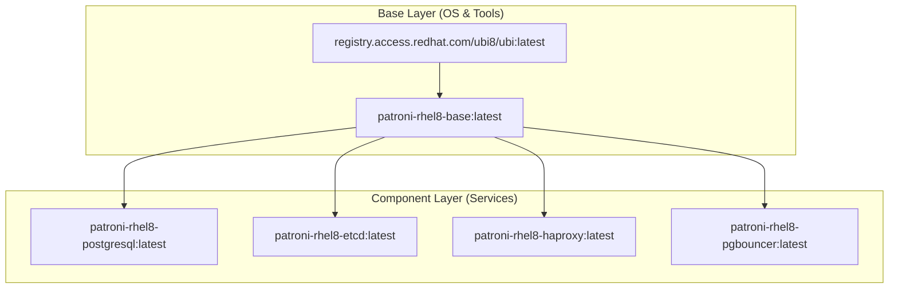

# 🐳 Guide des Images Docker

Ce document détaille la hiérarchie et le rôle de chaque image Docker utilisée dans le cluster Patroni Lab.

## 🏗️ Hiérarchie des Images

Toutes les images du projet reposent sur une image de base unique (`patroni-rhel8-base`) pour garantir la cohérence des versions de Python, des outils système et des certificats CA.

## 📋 Détails des Images

| Image | Fichier Source | Rôle Principal & Détails Techniques |
| :--- | :--- | :--- |
| `patroni-rhel8-base` | `Dockerfile.base` | **Fondation** : Python 3.12, outils système, repositories PGDG/EPEL, certs SSH/CA. |
| `patroni-rhel8-postgresql` | `Dockerfile.postgresql` | **Database** : PostgreSQL 17, Patroni 4.1.0, drivers etcd3. Géré par `supervisord`. |
| `patroni-rhel8-etcd` | `Dockerfile.etcd` | **DCS** : ETCD 3.6. Gère le quorum. Entrypoint gérant l'auto-détection du cluster. |
| `patroni-rhel8-haproxy` | `Dockerfile.haproxy` | **Ingress** : HAProxy gérant le routage TCP, SSL et PROXY v2. Configurée via `haproxy.cfg.rendered`. |
| `patroni-rhel8-pgbouncer`| `Dockerfile.pgbouncer`| **Pooling** : PgBouncer géré par `supervisord`. Gère dynamiquement `userlist.txt` via script d'initialisation. |

## 🚀 Processus de Build

Le build est orchestré par le `Makefile` pour s'assurer que l'image de base est construite avant les composants fils.

1. **Base Building** : `docker build -t patroni-rhel8-base:latest -f Dockerfile.base .`
2. **Parallel Component Building** : Les images filles sont construites en parallèle une fois la base prête.

---
[Retour à l'accueil](../README.md)
